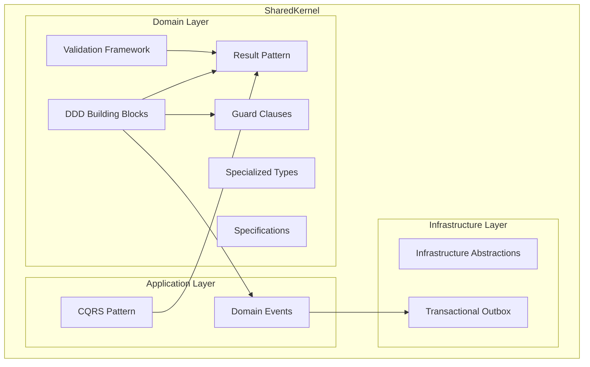
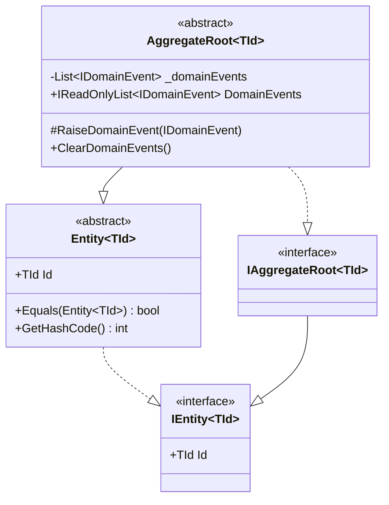
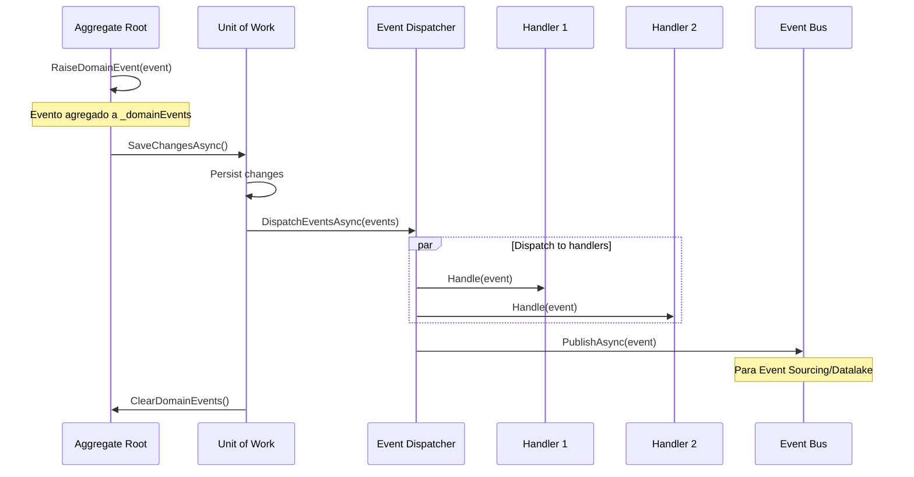
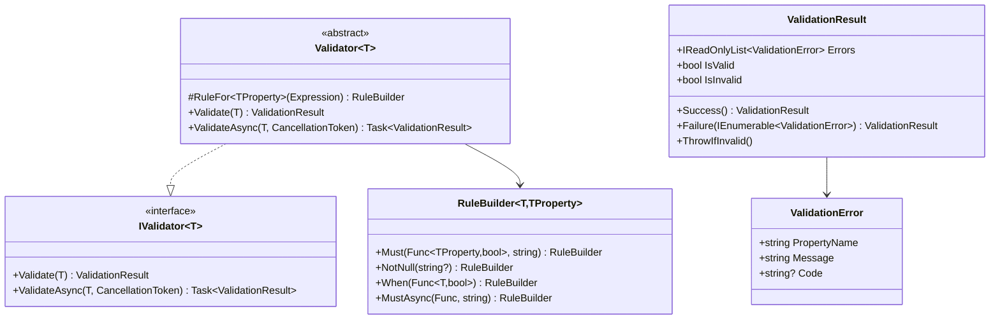
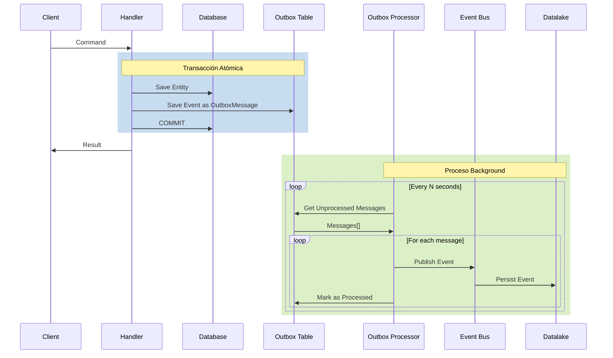
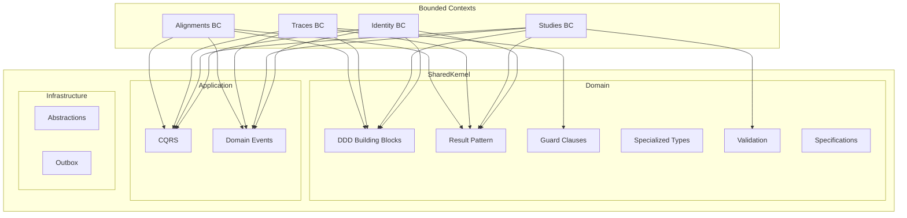

# SharedKernel - Documentación Arquitectónica

## Tabla de Contenidos

1. [Introducción](#1-introducción)
2. [Visión General de la Arquitectura](#2-visión-general-de-la-arquitectura)
3. [Domain-Driven Design (DDD)](#3-domain-driven-design-ddd)
   - 3.1 [Entidades](#31-entidades)
   - 3.2 [Aggregate Roots](#32-aggregate-roots)
   - 3.3 [Value Objects](#33-value-objects)
   - 3.4 [Domain Events](#34-domain-events)
4. [Result Pattern](#4-result-pattern)
   - 4.1 [Error Handling](#41-error-handling)
   - 4.2 [Result y Result&lt;T&gt;](#42-result-y-resultt)
   - 4.3 [Railway-Oriented Programming](#43-railway-oriented-programming)
5. [CQRS Pattern](#5-cqrs-pattern)
6. [Specification Pattern](#6-specification-pattern)
7. [Guard Clauses](#7-guard-clauses)
8. [Validation Framework](#8-validation-framework)
9. [Strongly-Typed IDs](#9-strongly-typed-ids)
10. [Smart Enumerations](#10-smart-enumerations)
11. [Maybe Monad](#11-maybe-monad)
12. [Auditoría y Soft Delete](#12-auditoría-y-soft-delete)
13. [Pagination](#13-pagination)
14. [Infrastructure Abstractions](#14-infrastructure-abstractions)
15. [Transactional Outbox Pattern](#15-transactional-outbox-pattern)
16. [Diagrama de Dependencias](#16-diagrama-de-dependencias)
17. [Guía de Uso](#17-guía-de-uso)
18. [Referencias](#18-referencias)

---

## 1. Introducción

El **SharedKernel** es un módulo fundamental en arquitecturas basadas en Domain-Driven Design (DDD) que proporciona abstracciones, patrones y utilidades compartidas entre todos los Bounded Contexts de la aplicación. Este documento describe exhaustivamente cada componente del SharedKernel de GeneFlow.ApiNet2, sus fundamentos teóricos, implementación y casos de uso.

### 1.1 Propósito

El SharedKernel tiene como objetivos principales:

1. **Establecer un vocabulario común** entre todos los módulos del sistema
2. **Proporcionar building blocks** para implementar patrones DDD
3. **Garantizar consistencia** en el manejo de errores, validaciones y eventos
4. **Reducir duplicación** de código entre Bounded Contexts
5. **Facilitar el testing** mediante abstracciones inyectables

### 1.2 Principios de Diseño

El SharedKernel sigue los principios SOLID:

- **Single Responsibility**: Cada clase tiene una única razón de cambio
- **Open/Closed**: Extensible mediante herencia y composición
- **Liskov Substitution**: Las abstracciones son sustituibles por implementaciones
- **Interface Segregation**: Interfaces pequeñas y cohesivas
- **Dependency Inversion**: Dependencia de abstracciones, no implementaciones

---

## 2. Visión General de la Arquitectura

### 2.1 Estructura de Capas

```
SharedKernel/
├── Application/                 # Capa de aplicación
│   ├── CQRS/                   # Command Query Responsibility Segregation
│   │   ├── ICommand.cs
│   │   ├── ICommandHandler.cs
│   │   ├── IQuery.cs
│   │   └── IQueryHandler.cs
│   └── EventNotifications/     # Domain Events
│       ├── IDomainEvent.cs
│       ├── DomainEvent.cs
│       ├── IDomainEventHandler.cs
│       └── IDomainEventDispatcher.cs
│
├── Domain/                      # Capa de dominio
│   ├── DDD/                    # Building blocks DDD
│   │   ├── IEntity.cs
│   │   ├── Entity.cs
│   │   ├── IAggregateRoot.cs
│   │   ├── AggregateRoot.cs
│   │   ├── ValueObject.cs
│   │   └── SingleValueObject.cs
│   │
│   ├── Results/                # Result Pattern
│   │   ├── Error.cs
│   │   ├── Result.cs
│   │   ├── ResultT.cs
│   │   ├── ResultExtensions.cs
│   │   └── DomainErrors.cs
│   │
│   ├── Guards/                 # Guard Clauses
│   │   ├── Guard.cs
│   │   ├── GuardAgainstNull.cs
│   │   ├── GuardAgainstString.cs
│   │   ├── GuardAgainstNumber.cs
│   │   ├── GuardAgainstGuid.cs
│   │   ├── GuardAgainstDateTime.cs
│   │   ├── GuardAgainstCondition.cs
│   │   └── GuardAgainstCollection.cs
│   │
│   ├── Types/                  # Tipos especializados
│   │   ├── StronglyTypedId.cs
│   │   ├── Enumeration.cs
│   │   └── Maybe.cs
│   │
│   ├── Validation/             # Framework de validación
│   │   ├── IValidator.cs
│   │   ├── Validator.cs
│   │   ├── ValidationRule.cs
│   │   ├── RuleBuilder.cs
│   │   ├── RuleBuilderExtensions.cs
│   │   ├── ValidationError.cs
│   │   ├── ValidationResult.cs
│   │   └── ValidationException.cs
│   │
│   ├── Pagination/             # Paginación
│   │   ├── PagedList.cs
│   │   ├── PagedRequest.cs
│   │   └── PagedListExtensions.cs
│   │
│   ├── Auditing/               # Auditoría
│   │   ├── IAuditable.cs
│   │   ├── AuditableEntity.cs
│   │   ├── AuditableAggregateRoot.cs
│   │   ├── AuditEntry.cs
│   │   └── IAuditTrailRepository.cs
│   │
│   ├── Exceptions/             # Excepciones de dominio
│   │   ├── DomainException.cs
│   │   └── GuardException.cs
│   │
│   ├── Utilities/              # Utilidades
│   │   └── TokenGenerator.cs
│   │
│   ├── IRepository.cs          # Repositorio genérico
│   ├── IUnitOfWork.cs          # Unit of Work
│   ├── IDomainService.cs       # Servicios de dominio
│   ├── ISpecification.cs       # Specification pattern
│   ├── Specification.cs
│   ├── IAuditable.cs
│   └── ISoftDeletable.cs
│
└── Infrastructure/              # Abstracciones de infraestructura
    ├── IDateTimeProvider.cs
    ├── ICacheService.cs
    ├── IMessageBroker.cs
    ├── IGuidGenerator.cs
    ├── IBackgroundJobScheduler.cs
    ├── IDomainEventDispatcher.cs
    └── Outbox/                 # Transactional Outbox
        ├── OutboxMessage.cs
        ├── IOutboxProcessor.cs
        └── IOutboxRepository.cs
```

### 2.2 Diagrama de Componentes



---

## 3. Domain-Driven Design (DDD)

Domain-Driven Design es un enfoque de diseño de software que se centra en modelar el dominio del negocio de manera explícita en el código. El SharedKernel proporciona los building blocks fundamentales para implementar DDD.

### 3.1 Entidades

#### 3.1.1 Concepto Teórico

Una **Entidad** es un objeto que se distingue por su identidad, no por sus atributos. Dos entidades con los mismos atributos pero diferentes identificadores son consideradas distintas.

> "An object defined primarily by its identity is called an Entity."
> — Eric Evans, Domain-Driven Design

#### 3.1.2 Implementación

```csharp
/// <summary>
/// Interface for entities with a strongly-typed identifier.
/// </summary>
public interface IEntity<out TId> where TId : notnull
{
    TId Id { get; }
}

/// <summary>
/// Base class for entities with identity-based equality.
/// </summary>
public abstract class Entity<TId> : IEntity<TId>, IEquatable<Entity<TId>>
    where TId : notnull
{
    public TId Id { get; protected init; } = default!;

    protected Entity() { }
    protected Entity(TId id) => Id = id;

    public bool Equals(Entity<TId>? other)
    {
        if (other is null) return false;
        if (ReferenceEquals(this, other)) return true;
        if (GetType() != other.GetType()) return false;
        return Id.Equals(other.Id);
    }

    public override bool Equals(object? obj)
        => obj is Entity<TId> other && Equals(other);

    public override int GetHashCode() => Id.GetHashCode();

    public static bool operator ==(Entity<TId>? left, Entity<TId>? right)
        => Equals(left, right);

    public static bool operator !=(Entity<TId>? left, Entity<TId>? right)
        => !Equals(left, right);
}
```

#### 3.1.3 Características Clave

| Característica | Descripción |
|----------------|-------------|
| **Identidad** | Definida por `TId`, no por atributos |
| **Igualdad** | Basada en el identificador |
| **Mutabilidad** | Los atributos pueden cambiar, la identidad no |
| **Ciclo de vida** | Persiste a través del tiempo |

#### 3.1.4 Ejemplo de Uso

```csharp
public class User : Entity<UserId>
{
    public Email Email { get; private set; }
    public Username Username { get; private set; }

    private User() { } // Para EF Core

    public User(UserId id, Email email, Username username) : base(id)
    {
        Email = email;
        Username = username;
    }

    public void ChangeEmail(Email newEmail)
    {
        // La identidad permanece, solo cambia el atributo
        Email = newEmail;
    }
}
```

### 3.2 Aggregate Roots

#### 3.2.1 Concepto Teórico

Un **Aggregate** es un cluster de objetos de dominio que se trata como una unidad para propósitos de cambios de datos. El **Aggregate Root** es la única entidad por la cual el exterior puede referenciar al aggregate.

> "An Aggregate is a cluster of associated objects that we treat as a unit for the purpose of data changes."
> — Eric Evans, Domain-Driven Design

#### 3.2.2 Invariantes del Aggregate

1. Solo el Aggregate Root puede ser referenciado externamente
2. Las entidades internas solo pueden ser accedidas a través del Root
3. El Root garantiza la consistencia de todo el Aggregate
4. Los cambios al Aggregate son atómicos

#### 3.2.3 Implementación

```csharp
/// <summary>
/// Non-generic interface for aggregate roots.
/// </summary>
public interface IAggregateRoot
{
    IReadOnlyList<IDomainEvent> DomainEvents { get; }
    void ClearDomainEvents();
}

/// <summary>
/// Interface for aggregate roots with typed identifier.
/// </summary>
public interface IAggregateRoot<out TId> : IEntity<TId>, IAggregateRoot
    where TId : notnull;

/// <summary>
/// Base class for aggregate roots.
/// </summary>
public abstract class AggregateRoot<TId> : Entity<TId>, IAggregateRoot<TId>
    where TId : notnull
{
    private readonly List<IDomainEvent> _domainEvents = [];

    public IReadOnlyList<IDomainEvent> DomainEvents => _domainEvents.AsReadOnly();

    protected AggregateRoot() { }
    protected AggregateRoot(TId id) : base(id) { }

    protected void RaiseDomainEvent(IDomainEvent domainEvent)
    {
        _domainEvents.Add(domainEvent);
    }

    public void ClearDomainEvents()
    {
        _domainEvents.Clear();
    }
}
```

#### 3.2.4 Diagrama de Aggregate



#### 3.2.5 Ejemplo: Study Aggregate

```csharp
public class Study : AggregateRoot<StudyId>
{
    private readonly List<StudyMember> _members = [];

    public StudyTitle Title { get; private set; }
    public StudyStatus Status { get; private set; }
    public UserId OwnerId { get; private set; }
    public IReadOnlyList<StudyMember> Members => _members.AsReadOnly();

    private Study() { }

    public static Study Create(StudyId id, StudyTitle title, UserId ownerId)
    {
        var study = new Study
        {
            Id = id,
            Title = title,
            Status = StudyStatus.Draft,
            OwnerId = ownerId
        };

        study._members.Add(StudyMember.CreateOwner(id, ownerId));
        study.RaiseDomainEvent(new StudyCreatedEvent(id, title, ownerId));

        return study;
    }

    public Result AddMember(UserId userId, StudyRole role)
    {
        // Invariante: No duplicados
        if (_members.Exists(m => m.UserId == userId))
            return StudyErrors.MemberAlreadyExists;

        // Invariante: Solo el owner puede ser owner
        if (role == StudyRole.Owner)
            return StudyErrors.CannotAddSecondOwner;

        _members.Add(StudyMember.Create(Id, userId, role));
        RaiseDomainEvent(new StudyMemberAddedEvent(Id, userId, role));

        return Result.Success();
    }
}
```

### 3.3 Value Objects

#### 3.3.1 Concepto Teórico

Un **Value Object** es un objeto que describe alguna característica o atributo pero no tiene identidad conceptual. Se define completamente por sus atributos.

> "An object that represents a descriptive aspect of the domain with no conceptual identity is called a Value Object."
> — Eric Evans, Domain-Driven Design

#### 3.3.2 Características

| Característica | Descripción |
|----------------|-------------|
| **Sin identidad** | Definido por sus atributos |
| **Inmutable** | Una vez creado, no cambia |
| **Intercambiable** | Dos VOs con mismos atributos son iguales |
| **Auto-validante** | Garantiza su propia consistencia |

#### 3.3.3 Implementación

```csharp
/// <summary>
/// Base class for value objects with structural equality.
/// </summary>
public abstract class ValueObject : IEquatable<ValueObject>
{
    /// <summary>
    /// Gets the components used for equality comparison.
    /// </summary>
    protected abstract IEnumerable<object?> GetEqualityComponents();

    public bool Equals(ValueObject? other)
    {
        if (other is null) return false;
        if (ReferenceEquals(this, other)) return true;
        if (GetType() != other.GetType()) return false;

        return GetEqualityComponents()
            .SequenceEqual(other.GetEqualityComponents());
    }

    public override bool Equals(object? obj)
        => obj is ValueObject other && Equals(other);

    public override int GetHashCode()
    {
        return GetEqualityComponents()
            .Aggregate(0, (hash, component) =>
                HashCode.Combine(hash, component?.GetHashCode() ?? 0));
    }

    public static bool operator ==(ValueObject? left, ValueObject? right)
        => Equals(left, right);

    public static bool operator !=(ValueObject? left, ValueObject? right)
        => !Equals(left, right);
}
```

#### 3.3.4 SingleValueObject

Para Value Objects que encapsulan un único valor:

```csharp
/// <summary>
/// Base class for value objects that wrap a single value.
/// </summary>
public abstract class SingleValueObject<T> : ValueObject where T : notnull
{
    public T Value { get; }

    protected SingleValueObject(T value) => Value = value;

    protected override IEnumerable<object?> GetEqualityComponents()
    {
        yield return Value;
    }

    public override string ToString() => Value.ToString() ?? string.Empty;

    public static implicit operator T(SingleValueObject<T> valueObject)
        => valueObject.Value;
}
```

#### 3.3.5 Ejemplos de Value Objects

```csharp
// Value Object simple con validación
public sealed class Email : SingleValueObject<string>
{
    private static readonly Regex EmailRegex = new(
        @"^[^@\s]+@[^@\s]+\.[^@\s]+$",
        RegexOptions.Compiled);

    private Email(string value) : base(value) { }

    public static Result<Email> Create(string value)
    {
        if (string.IsNullOrWhiteSpace(value))
            return UserErrors.EmailRequired;

        if (!EmailRegex.IsMatch(value))
            return UserErrors.EmailInvalid;

        return new Email(value.ToLowerInvariant());
    }
}

// Value Object compuesto
public sealed class Address : ValueObject
{
    public string Street { get; }
    public string City { get; }
    public string PostalCode { get; }
    public string Country { get; }

    private Address(string street, string city, string postalCode, string country)
    {
        Street = street;
        City = city;
        PostalCode = postalCode;
        Country = country;
    }

    public static Result<Address> Create(
        string street, string city, string postalCode, string country)
    {
        // Validaciones...
        return new Address(street, city, postalCode, country);
    }

    protected override IEnumerable<object?> GetEqualityComponents()
    {
        yield return Street;
        yield return City;
        yield return PostalCode;
        yield return Country;
    }
}

// Value Object con comportamiento
public sealed class Money : ValueObject
{
    public decimal Amount { get; }
    public Currency Currency { get; }

    private Money(decimal amount, Currency currency)
    {
        Amount = amount;
        Currency = currency;
    }

    public static Money Create(decimal amount, Currency currency)
    {
        Guard.Against.Negative(amount, nameof(amount));
        return new Money(amount, currency);
    }

    public Money Add(Money other)
    {
        if (Currency != other.Currency)
            throw new DomainException("Cannot add money with different currencies");

        return new Money(Amount + other.Amount, Currency);
    }

    protected override IEnumerable<object?> GetEqualityComponents()
    {
        yield return Amount;
        yield return Currency;
    }
}
```

### 3.4 Domain Events

#### 3.4.1 Concepto Teórico

Un **Domain Event** captura algo que sucedió en el dominio que es de interés para los expertos del dominio. Los eventos son inmutables y representan hechos del pasado.

> "Domain Events represent something that happened in the past."
> — Implementing Domain-Driven Design, Vaughn Vernon

#### 3.4.2 Implementación

```csharp
/// <summary>
/// Marker interface for domain events.
/// </summary>
public interface IDomainEvent : INotification
{
    Guid EventId { get; }
    DateTime OccurredAt { get; }
}

/// <summary>
/// Base record for domain events.
/// </summary>
public abstract record DomainEvent : IDomainEvent
{
    public Guid EventId { get; } = Guid.NewGuid();
    public DateTime OccurredAt { get; } = DateTime.UtcNow;
}

/// <summary>
/// Handler for domain events.
/// </summary>
public interface IDomainEventHandler<TEvent> : INotificationHandler<TEvent>
    where TEvent : IDomainEvent;

/// <summary>
/// Dispatches domain events to their handlers.
/// </summary>
public interface IDomainEventDispatcher
{
    Task DispatchEventsAsync(
        IEnumerable<IDomainEvent> events,
        CancellationToken cancellationToken = default);
}
```

#### 3.4.3 Ciclo de Vida de un Domain Event



#### 3.4.4 Ejemplos de Domain Events

```csharp
// Evento simple
public sealed record UserRegisteredEvent(
    UserId UserId,
    Email Email,
    Username Username) : DomainEvent;

// Evento con datos adicionales
public sealed record TraceProcessedEvent(
    TraceId TraceId,
    StudyId StudyId,
    QualityMetrics Metrics,
    string Sequence) : DomainEvent;

// Handler del evento
public sealed class SendWelcomeEmailHandler
    : IDomainEventHandler<UserRegisteredEvent>
{
    private readonly IEmailService _emailService;

    public SendWelcomeEmailHandler(IEmailService emailService)
    {
        _emailService = emailService;
    }

    public async Task Handle(
        UserRegisteredEvent notification,
        CancellationToken cancellationToken)
    {
        await _emailService.SendWelcomeEmailAsync(
            notification.Email,
            notification.Username,
            cancellationToken);
    }
}
```

---

## 4. Result Pattern

El Result Pattern es una alternativa a las excepciones para el manejo de errores esperados. Hace explícito en el sistema de tipos que una operación puede fallar.

### 4.1 Error Handling

#### 4.1.1 Filosofía de Diseño

```
┌─────────────────────────────────────────────────────────────────┐
│                     TIPOS DE ERRORES                            │
├─────────────────────────────────────────────────────────────────┤
│                                                                 │
│  ┌──────────────────┐        ┌──────────────────┐              │
│  │   EXCEPCIONES    │        │   RESULT PATTERN │              │
│  │                  │        │                  │              │
│  │ • Errores de     │        │ • Errores de     │              │
│  │   programación   │        │   negocio        │              │
│  │ • NullReference  │        │ • Validación     │              │
│  │ • OutOfMemory    │        │ • Not Found      │              │
│  │ • Network        │        │ • Conflictos     │              │
│  │   failures       │        │ • Autorizacion   │              │
│  │                  │        │                  │              │
│  │ ¡NO ESPERADOS!   │        │ ¡ESPERADOS!      │              │
│  └──────────────────┘        └──────────────────┘              │
│                                                                 │
└─────────────────────────────────────────────────────────────────┘
```

#### 4.1.2 Estructura de Error

```csharp
/// <summary>
/// Represents an error with a code and message.
/// </summary>
public sealed record Error
{
    public string Code { get; }
    public string Message { get; }
    public ErrorType Type { get; }

    private Error(string code, string message, ErrorType type)
    {
        Code = code;
        Message = message;
        Type = type;
    }

    // Factory methods
    public static Error Failure(string code, string message)
        => new(code, message, ErrorType.Failure);

    public static Error Validation(string code, string message)
        => new(code, message, ErrorType.Validation);

    public static Error NotFound(string code, string message)
        => new(code, message, ErrorType.NotFound);

    public static Error Conflict(string code, string message)
        => new(code, message, ErrorType.Conflict);

    public static Error Unauthorized(string code, string message)
        => new(code, message, ErrorType.Unauthorized);

    public static Error Forbidden(string code, string message)
        => new(code, message, ErrorType.Forbidden);

    public static Error Unexpected(string code, string message)
        => new(code, message, ErrorType.Unexpected);

    public static readonly Error None = new(string.Empty, string.Empty, ErrorType.None);
}

/// <summary>
/// Categorizes errors for proper HTTP status code mapping.
/// </summary>
public enum ErrorType
{
    None = 0,
    Failure = 1,      // 400 Bad Request
    Validation = 2,   // 400 Bad Request
    NotFound = 3,     // 404 Not Found
    Conflict = 4,     // 409 Conflict
    Unauthorized = 5, // 401 Unauthorized
    Forbidden = 6,    // 403 Forbidden
    Unexpected = 7    // 500 Internal Server Error
}
```

#### 4.1.3 Definición de Errores de Dominio

```csharp
/// <summary>
/// General domain errors.
/// </summary>
public static class DomainErrors
{
    public static class General
    {
        public static Error NotFound(string entityName, object id) => Error.NotFound(
            $"{entityName}.NotFound",
            $"{entityName} with ID '{id}' was not found");

        public static Error ValueIsRequired(string valueName) => Error.Validation(
            "General.ValueIsRequired",
            $"'{valueName}' is required");
    }
}

/// <summary>
/// User-specific domain errors.
/// </summary>
public static class UserErrors
{
    public static Error NotFound(UserId id) => Error.NotFound(
        "User.NotFound",
        $"User with ID '{id.Value}' was not found");

    public static readonly Error EmailAlreadyExists = Error.Conflict(
        "User.EmailAlreadyExists",
        "A user with this email already exists");

    public static readonly Error InvalidCredentials = Error.Unauthorized(
        "User.InvalidCredentials",
        "Invalid email or password");

    public static readonly Error AccountLocked = Error.Forbidden(
        "User.AccountLocked",
        "Account is locked due to too many failed login attempts");
}
```

### 4.2 Result y Result&lt;T&gt;

#### 4.2.1 Result (sin valor)

```csharp
/// <summary>
/// Represents the result of an operation that does not return a value.
/// </summary>
public class Result
{
    public bool IsSuccess { get; }
    public bool IsFailure => !IsSuccess;
    public Error Error { get; }
    public Error[] Errors { get; }

    protected Result(bool isSuccess, Error error)
    {
        IsSuccess = isSuccess;
        Error = error;
        Errors = error == Error.None ? [] : [error];
    }

    protected Result(bool isSuccess, Error[] errors)
    {
        IsSuccess = isSuccess;
        Errors = errors;
        Error = errors.Length > 0 ? errors[0] : Error.None;
    }

    public static Result Success() => new(true, Error.None);
    public static Result Failure(Error error) => new(false, error);
    public static Result Failure(params Error[] errors) => new(false, errors);

    // Pattern matching
    public TResult Match<TResult>(
        Func<TResult> onSuccess,
        Func<Error[], TResult> onFailure)
        => IsSuccess ? onSuccess() : onFailure(Errors);

    // Fluent callbacks
    public Result OnSuccess(Action action)
    {
        if (IsSuccess) action();
        return this;
    }

    public Result OnFailure(Action<Error[]> action)
    {
        if (IsFailure) action(Errors);
        return this;
    }

    // Combine multiple results
    public static Result Combine(params Result[] results)
    {
        var failedResults = results.Where(r => r.IsFailure).ToArray();
        if (failedResults.Length == 0)
            return Success();

        var allErrors = failedResults.SelectMany(r => r.Errors).ToArray();
        return Failure(allErrors);
    }
}
```

#### 4.2.2 Result&lt;T&gt; (con valor)

```csharp
/// <summary>
/// Represents the result of an operation that returns a value.
/// </summary>
public sealed class Result<TValue> : Result
{
    private readonly TValue? _value;

    public TValue Value => IsSuccess
        ? _value!
        : throw new InvalidOperationException(
            $"Cannot access value of a failed result. Error: {Error}");

    private Result(TValue value) : base(true, Error.None) => _value = value;
    private Result(Error error) : base(false, error) => _value = default;
    private Result(Error[] errors) : base(false, errors) => _value = default;

    public static Result<TValue> Success(TValue value) => new(value);
    public new static Result<TValue> Failure(Error error) => new(error);
    public new static Result<TValue> Failure(params Error[] errors) => new(errors);

    // Safe value access
    public TValue? GetValueOrDefault(TValue? defaultValue = default)
        => IsSuccess ? _value : defaultValue;

    public bool TryGetValue([NotNullWhen(true)] out TValue? value)
    {
        value = _value;
        return IsSuccess;
    }

    // Functor: Transform value if success
    public Result<TNew> Map<TNew>(Func<TValue, TNew> mapper)
        => IsSuccess
            ? Result<TNew>.Success(mapper(_value!))
            : Result<TNew>.Failure(Errors);

    // Monad: Chain operations
    public Result<TNew> Bind<TNew>(Func<TValue, Result<TNew>> binder)
        => IsSuccess ? binder(_value!) : Result<TNew>.Failure(Errors);

    // Pattern matching with value
    public TResult Match<TResult>(
        Func<TValue, TResult> onSuccess,
        Func<Error[], TResult> onFailure)
        => IsSuccess ? onSuccess(_value!) : onFailure(Errors);

    // Validation
    public Result<TValue> Ensure(Func<TValue, bool> predicate, Error error)
    {
        if (IsFailure) return this;
        return predicate(_value!) ? this : Failure(error);
    }

    // Implicit conversions
    public static implicit operator Result<TValue>(TValue value) => Success(value);
    public static implicit operator Result<TValue>(Error error) => Failure(error);
}
```

### 4.3 Railway-Oriented Programming

El Result Pattern habilita Railway-Oriented Programming, donde el flujo de datos sigue dos "vías": éxito o fallo.

```
        ┌──────────────────────────────────────────────────────────┐
        │                    SUCCESS TRACK                          │
        │  ════════════════════════════════════════════════════>   │
Input ──┼──> Validate ──> Transform ──> Save ──> Notify ──> Output │
        │       │              │          │         │              │
        │       ▼              ▼          ▼         ▼              │
        │  ────────────────────────────────────────────────────>   │
        │                    FAILURE TRACK                          │
        └──────────────────────────────────────────────────────────┘
```

#### 4.3.1 Ejemplo de Pipeline

```csharp
public async Task<Result<UserDto>> RegisterUserAsync(RegisterUserCommand command)
{
    // Railway: cada paso puede desviar al track de fallo
    return await ValidateCommand(command)
        .Bind(cmd => Email.Create(cmd.Email))
        .Bind(email => CheckEmailNotExists(email))
        .Bind(email => CreateUser(command, email))
        .Bind(user => SaveUser(user))
        .Map(user => user.ToDto());
}

// Con async/await extensions
public async Task<Result<UserDto>> RegisterUserAsync(RegisterUserCommand command)
{
    var emailResult = Email.Create(command.Email);
    if (emailResult.IsFailure)
        return emailResult.Error;

    var existsResult = await _userRepository.ExistsByEmailAsync(emailResult.Value);
    if (existsResult)
        return UserErrors.EmailAlreadyExists;

    var user = User.Create(
        UserId.New(),
        emailResult.Value,
        Username.Create(command.Username).Value);

    await _userRepository.AddAsync(user);
    await _unitOfWork.SaveChangesAsync();

    return user.ToDto();
}
```

#### 4.3.2 Extension Methods para Async

```csharp
public static class ResultExtensions
{
    public static async Task<Result<TNew>> Map<TValue, TNew>(
        this Task<Result<TValue>> resultTask,
        Func<TValue, TNew> mapper)
    {
        var result = await resultTask;
        return result.Map(mapper);
    }

    public static async Task<Result<TNew>> Bind<TValue, TNew>(
        this Task<Result<TValue>> resultTask,
        Func<TValue, Task<Result<TNew>>> binder)
    {
        var result = await resultTask;
        return await result.BindAsync(binder);
    }

    public static async Task<TResult> Match<TValue, TResult>(
        this Task<Result<TValue>> resultTask,
        Func<TValue, TResult> onSuccess,
        Func<Error[], TResult> onFailure)
    {
        var result = await resultTask;
        return result.Match(onSuccess, onFailure);
    }
}
```

---

## 5. CQRS Pattern

Command Query Responsibility Segregation (CQRS) separa las operaciones de lectura (Queries) de las operaciones de escritura (Commands).

### 5.1 Fundamentos Teóricos

```
┌─────────────────────────────────────────────────────────────────┐
│                         CQRS PATTERN                            │
├─────────────────────────────────────────────────────────────────┤
│                                                                 │
│   ┌─────────────┐                      ┌─────────────┐         │
│   │   CLIENT    │                      │   CLIENT    │         │
│   └──────┬──────┘                      └──────┬──────┘         │
│          │                                    │                 │
│          ▼                                    ▼                 │
│   ┌─────────────┐                      ┌─────────────┐         │
│   │   COMMAND   │                      │    QUERY    │         │
│   │  (Write)    │                      │   (Read)    │         │
│   └──────┬──────┘                      └──────┬──────┘         │
│          │                                    │                 │
│          ▼                                    ▼                 │
│   ┌─────────────┐                      ┌─────────────┐         │
│   │   HANDLER   │                      │   HANDLER   │         │
│   └──────┬──────┘                      └──────┬──────┘         │
│          │                                    │                 │
│          ▼                                    ▼                 │
│   ┌─────────────┐                      ┌─────────────┐         │
│   │   DOMAIN    │                      │  READ MODEL │         │
│   │   MODEL     │                      │  (Optimized)│         │
│   └──────┬──────┘                      └─────────────┘         │
│          │                                                      │
│          ▼                                                      │
│   ┌─────────────┐                                              │
│   │  DATABASE   │                                              │
│   └─────────────┘                                              │
│                                                                 │
└─────────────────────────────────────────────────────────────────┘
```

### 5.2 Implementación

```csharp
// Commands
public interface ICommand : IRequest;
public interface ICommand<out TResponse> : IRequest<TResponse>;

public interface ICommandHandler<TCommand> : IRequestHandler<TCommand>
    where TCommand : ICommand;

public interface ICommandHandler<TCommand, TResponse>
    : IRequestHandler<TCommand, TResponse>
    where TCommand : ICommand<TResponse>;

// Queries
public interface IQuery<out TResponse> : IRequest<TResponse>;

public interface IQueryHandler<TQuery, TResponse>
    : IRequestHandler<TQuery, TResponse>
    where TQuery : IQuery<TResponse>;
```

### 5.3 Ejemplos

```csharp
// Command sin retorno (solo Result para indicar éxito/fallo)
public sealed record DeleteStudyCommand(StudyId StudyId) : ICommand<Result>;

public sealed class DeleteStudyCommandHandler
    : ICommandHandler<DeleteStudyCommand, Result>
{
    private readonly IStudyRepository _repository;
    private readonly IStudyUnitOfWork _unitOfWork;

    public async Task<Result> Handle(
        DeleteStudyCommand request,
        CancellationToken cancellationToken)
    {
        var study = await _repository.GetByIdAsync(request.StudyId, cancellationToken);
        if (study is null)
            return StudyErrors.NotFound(request.StudyId);

        _repository.Remove(study);
        await _unitOfWork.SaveChangesAsync(cancellationToken);

        return Result.Success();
    }
}

// Command con retorno
public sealed record CreateStudyCommand(
    string Title,
    string Description,
    UserId OwnerId) : ICommand<Result<StudyDto>>;

// Query
public sealed record GetStudyByIdQuery(StudyId Id) : IQuery<Result<StudyDto>>;

public sealed class GetStudyByIdQueryHandler
    : IQueryHandler<GetStudyByIdQuery, Result<StudyDto>>
{
    private readonly IStudyRepository _repository;

    public async Task<Result<StudyDto>> Handle(
        GetStudyByIdQuery request,
        CancellationToken cancellationToken)
    {
        var study = await _repository.GetByIdAsync(request.Id, cancellationToken);

        return study is null
            ? StudyErrors.NotFound(request.Id)
            : study.ToDto();
    }
}
```

---

## 6. Specification Pattern

El Specification Pattern encapsula lógica de consulta en objetos reutilizables y componibles.

### 6.1 Implementación

```csharp
/// <summary>
/// Interface for the Specification pattern.
/// </summary>
public interface ISpecification<T>
{
    Expression<Func<T, bool>> Criteria { get; }
    bool IsSatisfiedBy(T entity);
}

/// <summary>
/// Base class for specifications.
/// </summary>
public abstract class Specification<T> : ISpecification<T>
{
    public abstract Expression<Func<T, bool>> Criteria { get; }

    public bool IsSatisfiedBy(T entity) => Criteria.Compile()(entity);

    // Composición con operadores
    public static Specification<T> operator &(Specification<T> left, Specification<T> right)
        => new AndSpecification<T>(left, right);

    public static Specification<T> operator |(Specification<T> left, Specification<T> right)
        => new OrSpecification<T>(left, right);

    public static Specification<T> operator !(Specification<T> spec)
        => new NotSpecification<T>(spec);
}

// Implementaciones internas
internal sealed class AndSpecification<T>(
    Specification<T> left,
    Specification<T> right) : Specification<T>
{
    public override Expression<Func<T, bool>> Criteria
    {
        get
        {
            var param = Expression.Parameter(typeof(T), "x");
            var body = Expression.AndAlso(
                Expression.Invoke(left.Criteria, param),
                Expression.Invoke(right.Criteria, param));
            return Expression.Lambda<Func<T, bool>>(body, param);
        }
    }
}
```

### 6.2 Ejemplos de Uso

```csharp
// Especificaciones individuales
public sealed class ActiveStudySpecification : Specification<Study>
{
    public override Expression<Func<Study, bool>> Criteria
        => study => study.Status == StudyStatus.Active;
}

public sealed class StudyByOwnerSpecification(UserId ownerId) : Specification<Study>
{
    public override Expression<Func<Study, bool>> Criteria
        => study => study.OwnerId == ownerId;
}

public sealed class PublicStudySpecification : Specification<Study>
{
    public override Expression<Func<Study, bool>> Criteria
        => study => study.Settings.IsPublic;
}

// Composición
var spec = new ActiveStudySpecification()
         & new StudyByOwnerSpecification(userId)
         & !new PublicStudySpecification();

// Uso en repositorio
var studies = await _repository.FindAsync(spec);

// O directamente en EF Core
var studies = await _context.Studies
    .Where(spec.Criteria)
    .ToListAsync();
```

---

## 7. Guard Clauses

Los Guard Clauses validan precondiciones y lanzan excepciones si no se cumplen. Son útiles para validar invariantes de dominio.

### 7.1 Estructura

```csharp
/// <summary>
/// Entry point for guard clauses.
/// </summary>
public static class Guard
{
    public static IGuardClause Against { get; } = new GuardClause();
}

public interface IGuardClause;
internal sealed class GuardClause : IGuardClause;
```

### 7.2 Guards Disponibles

| Categoría | Métodos |
|-----------|---------|
| **Null** | `Null`, `NullOrDefault`, `Default` |
| **String** | `NullOrEmpty`, `NullOrWhiteSpace`, `MaxLength`, `MinLength`, `LengthOutOfRange` |
| **Number** | `Negative`, `Zero`, `NegativeOrZero`, `OutOfRange`, `LessThan`, `GreaterThan` |
| **Guid** | `Empty`, `NullOrEmpty` |
| **DateTime** | `Past`, `Future`, `Default`, `OutOfRange` |
| **Collection** | `NullOrEmpty`, `ContainsNull`, `MaxCount` |
| **Condition** | `True`, `False`, `Expression` |

### 7.3 Implementación de Guards

```csharp
/// <summary>
/// Guard clauses for null validation.
/// </summary>
public static class GuardAgainstNull
{
    public static T Null<T>(this IGuardClause _, T? value, string parameterName)
        where T : class
    {
        if (value is null)
            throw GuardException.For(parameterName, "cannot be null");
        return value;
    }

    public static T NullOrDefault<T>(this IGuardClause _, T? value, string parameterName)
        where T : class
    {
        if (value is null)
            throw GuardException.For(parameterName, "cannot be null");
        if (EqualityComparer<T>.Default.Equals(value, default!))
            throw GuardException.For(parameterName, "cannot be default value");
        return value;
    }
}

/// <summary>
/// Guard clauses for string validation.
/// </summary>
public static class GuardAgainstString
{
    public static string NullOrWhiteSpace(
        this IGuardClause _, string? value, string parameterName)
    {
        if (string.IsNullOrWhiteSpace(value))
            throw GuardException.For(parameterName, "cannot be null, empty, or whitespace");
        return value;
    }

    public static string MaxLength(
        this IGuardClause _, string? value, int maxLength, string parameterName)
    {
        if (value is null)
            throw GuardException.For(parameterName, "cannot be null");
        if (value.Length > maxLength)
            throw GuardException.For(parameterName,
                $"cannot exceed {maxLength} characters (was {value.Length})");
        return value;
    }
}

/// <summary>
/// Guard clauses for numeric validation.
/// </summary>
public static class GuardAgainstNumber
{
    public static T Negative<T>(this IGuardClause _, T value, string parameterName)
        where T : INumber<T>
    {
        if (value < T.Zero)
            throw GuardException.For(parameterName, $"cannot be negative (was {value})");
        return value;
    }

    public static T OutOfRange<T>(
        this IGuardClause _, T value, T min, T max, string parameterName)
        where T : INumber<T>
    {
        if (value < min || value > max)
            throw GuardException.For(parameterName,
                $"must be between {min} and {max} (was {value})");
        return value;
    }
}
```

### 7.4 Ejemplos de Uso

```csharp
public sealed class StudyTitle : SingleValueObject<string>
{
    public const int MaxLength = 200;
    public const int MinLength = 3;

    private StudyTitle(string value) : base(value) { }

    public static StudyTitle Create(string value)
    {
        // Guards validan y retornan el valor validado
        var title = Guard.Against.NullOrWhiteSpace(value, nameof(value));
        title = Guard.Against.LengthOutOfRange(title, MinLength, MaxLength, nameof(value));

        return new StudyTitle(title.Trim());
    }
}

public class Study : AggregateRoot<StudyId>
{
    public void UpdateStorageQuota(long quotaInBytes)
    {
        Guard.Against.NegativeOrZero(quotaInBytes, nameof(quotaInBytes));
        Guard.Against.GreaterThan(quotaInBytes, MaxStorageQuota, nameof(quotaInBytes));

        StorageQuota = quotaInBytes;
    }
}
```

---

## 8. Validation Framework

El framework de validación proporciona una API fluent para definir reglas de validación complejas.

### 8.1 Arquitectura



### 8.2 Implementación del Validator

```csharp
public abstract class Validator<T> : IValidator<T>
{
    private readonly List<object> _rules = [];
    private readonly List<object> _asyncRules = [];

    protected RuleBuilder<T, TProperty> RuleFor<TProperty>(
        Expression<Func<T, TProperty>> propertyExpression)
    {
        var propertyName = GetPropertyName(propertyExpression);
        var propertySelector = propertyExpression.Compile();
        var rule = new ValidationRule<T, TProperty>(propertySelector, propertyName);
        _rules.Add(rule);
        return new RuleBuilder<T, TProperty>(this, rule);
    }

    public ValidationResult Validate(T instance)
    {
        var errors = new List<ValidationError>();

        foreach (var rule in _rules)
        {
            var method = rule.GetType().GetMethod("Evaluate");
            if (method?.Invoke(rule, [instance]) is IEnumerable<ValidationError> ruleErrors)
            {
                errors.AddRange(ruleErrors);
            }
        }

        return errors.Count > 0
            ? ValidationResult.Failure(errors)
            : ValidationResult.Success();
    }

    public async Task<ValidationResult> ValidateAsync(
        T instance, CancellationToken cancellationToken = default)
    {
        var errors = new List<ValidationError>();

        // Sync rules
        foreach (var rule in _rules)
        {
            var method = rule.GetType().GetMethod("Evaluate");
            if (method?.Invoke(rule, [instance]) is IEnumerable<ValidationError> ruleErrors)
                errors.AddRange(ruleErrors);
        }

        // Async rules
        foreach (var rule in _asyncRules)
        {
            var method = rule.GetType().GetMethod("EvaluateAsync");
            if (method is not null)
            {
                var task = method.Invoke(rule, [instance, cancellationToken])
                    as Task<ValidationError?>;
                if (task is not null)
                {
                    var error = await task;
                    if (error is not null)
                        errors.Add(error);
                }
            }
        }

        return errors.Count > 0
            ? ValidationResult.Failure(errors)
            : ValidationResult.Success();
    }
}
```

### 8.3 RuleBuilder y Extensiones

```csharp
public sealed class RuleBuilder<T, TProperty>
{
    private readonly Validator<T> _validator;
    private readonly ValidationRule<T, TProperty> _rule;

    public RuleBuilder<T, TProperty> Must(
        Func<TProperty, bool> predicate,
        string message,
        string? errorCode = null)
    {
        _rule.AddCondition(
            (value, _) => predicate(value),
            (_, _) => message,
            errorCode);
        return this;
    }

    public RuleBuilder<T, TProperty> NotNull(string? message = null, string? errorCode = null)
    {
        _rule.AddCondition(
            (value, _) => value is not null,
            (_, _) => message ?? "cannot be null",
            errorCode);
        return this;
    }

    public RuleBuilder<T, TProperty> When(Func<T, bool> condition)
    {
        _rule.WhenCondition = condition;
        return this;
    }

    public RuleBuilder<T, TProperty> MustAsync(
        Func<TProperty, CancellationToken, Task<bool>> predicate,
        string message,
        string? errorCode = null)
    {
        var asyncRule = new AsyncValidationRule<T, TProperty>(
            _rule.PropertySelector,
            _rule.PropertyName,
            (value, _, ct) => predicate(value, ct),
            (_, _) => message,
            errorCode);
        _validator.AddAsyncRule(asyncRule);
        return this;
    }
}

// Extension methods para tipos comunes
public static class RuleBuilderExtensions
{
    public static RuleBuilder<T, string?> NotEmpty<T>(
        this RuleBuilder<T, string?> builder,
        string? message = null,
        string? errorCode = null)
    {
        return builder.Must(
            value => !string.IsNullOrEmpty(value),
            message ?? "cannot be empty",
            errorCode);
    }

    public static RuleBuilder<T, string?> MaxLength<T>(
        this RuleBuilder<T, string?> builder,
        int maxLength,
        string? message = null,
        string? errorCode = null)
    {
        return builder.Must(
            value => value is null || value.Length <= maxLength,
            value => message ?? $"must not exceed {maxLength} characters",
            errorCode);
    }

    public static RuleBuilder<T, string?> EmailAddress<T>(
        this RuleBuilder<T, string?> builder,
        string? message = null,
        string? errorCode = null)
    {
        const string emailPattern = @"^[^@\s]+@[^@\s]+\.[^@\s]+$";
        return builder.Matches(emailPattern, message ?? "must be a valid email address", errorCode);
    }

    public static RuleBuilder<T, TProperty> GreaterThan<T, TProperty>(
        this RuleBuilder<T, TProperty> builder,
        TProperty threshold,
        string? message = null,
        string? errorCode = null)
        where TProperty : IComparable<TProperty>
    {
        return builder.Must(
            value => value.CompareTo(threshold) > 0,
            message ?? $"must be greater than {threshold}",
            errorCode);
    }
}
```

### 8.4 Ejemplo Completo de Validator

```csharp
public sealed class CreateStudyCommandValidator : Validator<CreateStudyCommand>
{
    private readonly IStudyRepository _studyRepository;

    public CreateStudyCommandValidator(IStudyRepository studyRepository)
    {
        _studyRepository = studyRepository;

        RuleFor(x => x.Title)
            .NotEmpty("Title is required")
            .MaxLength(200, "Title cannot exceed 200 characters");

        RuleFor(x => x.Description)
            .MaxLength(2000)
            .When(x => x.Description is not null);

        RuleFor(x => x.OwnerId)
            .NotNull("Owner ID is required")
            .Must(id => id.Value != Guid.Empty, "Owner ID cannot be empty");

        // Async validation
        RuleFor(x => x.Title)
            .MustAsync(TitleMustBeUnique, "A study with this title already exists");
    }

    private async Task<bool> TitleMustBeUnique(
        string title, CancellationToken cancellationToken)
    {
        return !await _studyRepository.ExistsByTitleAsync(title, cancellationToken);
    }
}

// Uso
var validator = new CreateStudyCommandValidator(studyRepository);
var result = await validator.ValidateAsync(command, cancellationToken);

if (result.IsInvalid)
{
    return result.ToResult<StudyDto>(); // Convierte a Result<T> con errores
}
```

---

## 9. Strongly-Typed IDs

Los Strongly-Typed IDs previenen errores al mezclar identificadores de diferentes entidades.

### 9.1 Problema que Resuelven

```csharp
// ❌ PELIGRO: Fácil confundir IDs
public void ProcessOrder(Guid orderId, Guid customerId, Guid productId)
{
    // ¿Qué pasa si se pasan en orden incorrecto?
}

// ✅ SEGURO: El compilador previene errores
public void ProcessOrder(OrderId orderId, CustomerId customerId, ProductId productId)
{
    // Imposible confundir - diferentes tipos
}
```

### 9.2 Implementación

```csharp
/// <summary>
/// Base class for strongly-typed identifiers.
/// </summary>
public abstract class StronglyTypedId<TId, TValue> : IEquatable<StronglyTypedId<TId, TValue>>
    where TId : StronglyTypedId<TId, TValue>
    where TValue : notnull
{
    public TValue Value { get; }

    protected StronglyTypedId(TValue value) => Value = value;

    public bool Equals(StronglyTypedId<TId, TValue>? other)
    {
        if (other is null) return false;
        return EqualityComparer<TValue>.Default.Equals(Value, other.Value);
    }

    public override bool Equals(object? obj)
        => obj is StronglyTypedId<TId, TValue> other && Equals(other);

    public override int GetHashCode() => Value.GetHashCode();
    public override string ToString() => Value.ToString() ?? string.Empty;

    public static bool operator ==(
        StronglyTypedId<TId, TValue>? left,
        StronglyTypedId<TId, TValue>? right)
        => Equals(left, right);

    public static bool operator !=(
        StronglyTypedId<TId, TValue>? left,
        StronglyTypedId<TId, TValue>? right)
        => !Equals(left, right);

    public static implicit operator TValue(StronglyTypedId<TId, TValue> id) => id.Value;
}

/// <summary>
/// Strongly-typed ID with Guid as underlying type.
/// </summary>
public abstract class StronglyTypedGuidId<TId> : StronglyTypedId<TId, Guid>
    where TId : StronglyTypedGuidId<TId>
{
    protected StronglyTypedGuidId(Guid value) : base(value) { }

    public bool IsEmpty => Value == Guid.Empty;
}
```

### 9.3 Definición de IDs

```csharp
public sealed class UserId : StronglyTypedGuidId<UserId>
{
    public UserId(Guid value) : base(value) { }

    public static UserId New() => new(Guid.NewGuid());
    public static UserId Empty => new(Guid.Empty);
}

public sealed class StudyId : StronglyTypedGuidId<StudyId>
{
    public StudyId(Guid value) : base(value) { }

    public static StudyId New() => new(Guid.NewGuid());
}

public sealed class TraceId : StronglyTypedGuidId<TraceId>
{
    public TraceId(Guid value) : base(value) { }

    public static TraceId New() => new(Guid.NewGuid());
}
```

### 9.4 Configuración en EF Core

```csharp
public class StudyConfiguration : IEntityTypeConfiguration<Study>
{
    public void Configure(EntityTypeBuilder<Study> builder)
    {
        builder.HasKey(s => s.Id);

        builder.Property(s => s.Id)
            .HasConversion(
                id => id.Value,           // A la base de datos
                value => new StudyId(value)); // Desde la base de datos

        builder.Property(s => s.OwnerId)
            .HasConversion(
                id => id.Value,
                value => new UserId(value));
    }
}
```

---

## 10. Smart Enumerations

Las Smart Enumerations son clases que simulan enums pero con capacidades adicionales como propiedades y métodos.

### 10.1 Ventajas sobre Enums Tradicionales

| Aspecto | Enum | Smart Enumeration |
|---------|------|-------------------|
| Propiedades adicionales | ❌ | ✅ |
| Métodos | ❌ | ✅ |
| Herencia | ❌ | ✅ |
| Serialización controlada | Limitada | ✅ |
| Comportamiento asociado | ❌ | ✅ |

### 10.2 Implementación

```csharp
/// <summary>
/// Base class for smart enumerations.
/// </summary>
public abstract class Enumeration<TEnum> : IEquatable<Enumeration<TEnum>>, IComparable<Enumeration<TEnum>>
    where TEnum : Enumeration<TEnum>
{
    private static readonly Lazy<Dictionary<int, TEnum>> _byId =
        new(GetAllById, LazyThreadSafetyMode.ExecutionAndPublication);
    private static readonly Lazy<Dictionary<string, TEnum>> _byName =
        new(GetAllByName, LazyThreadSafetyMode.ExecutionAndPublication);

    public int Id { get; }
    public string Name { get; }

    protected Enumeration(int id, string name)
    {
        Id = id;
        Name = name;
    }

    public static IReadOnlyCollection<TEnum> GetAll() => _byId.Value.Values.ToList();
    public static TEnum? FromId(int id) => _byId.Value.GetValueOrDefault(id);
    public static TEnum? FromName(string name) => _byName.Value.GetValueOrDefault(name.ToUpperInvariant());
    public static bool TryFromId(int id, out TEnum? result) { result = FromId(id); return result is not null; }
    public static bool IsDefined(int id) => _byId.Value.ContainsKey(id);

    private static Dictionary<int, TEnum> GetAllById()
    {
        return typeof(TEnum)
            .GetFields(BindingFlags.Public | BindingFlags.Static | BindingFlags.DeclaredOnly)
            .Where(f => f.FieldType == typeof(TEnum))
            .Select(f => (TEnum)f.GetValue(null)!)
            .ToDictionary(e => e.Id);
    }

    // Equality, comparison, operators...
}
```

### 10.3 Ejemplos

```csharp
// Enumeración básica
public sealed class StudyStatus : Enumeration<StudyStatus>
{
    public static readonly StudyStatus Draft = new(1, nameof(Draft));
    public static readonly StudyStatus Active = new(2, nameof(Active));
    public static readonly StudyStatus Completed = new(3, nameof(Completed));
    public static readonly StudyStatus Published = new(4, nameof(Published));
    public static readonly StudyStatus Archived = new(5, nameof(Archived));

    private StudyStatus(int id, string name) : base(id, name) { }

    // Comportamiento
    public bool CanTransitionTo(StudyStatus newStatus)
    {
        return (this, newStatus) switch
        {
            (_, _) when this == newStatus => false,
            ({ Id: 1 }, { Id: 2 }) => true,  // Draft -> Active
            ({ Id: 2 }, { Id: 3 }) => true,  // Active -> Completed
            ({ Id: 3 }, { Id: 4 }) => true,  // Completed -> Published
            ({ Id: 4 }, { Id: 5 }) => true,  // Published -> Archived
            _ => false
        };
    }

    public bool IsEditable => this == Draft || this == Active;
    public bool IsPubliclyVisible => this == Published;
}

// Enumeración con datos adicionales
public sealed class TraceFormat : Enumeration<TraceFormat>
{
    public static readonly TraceFormat Ab1 = new(1, "AB1", ".ab1", true);
    public static readonly TraceFormat Scf = new(2, "SCF", ".scf", true);
    public static readonly TraceFormat Fastq = new(3, "FASTQ", ".fastq", false);
    public static readonly TraceFormat Fasta = new(4, "FASTA", ".fasta", false);

    public string Extension { get; }
    public bool HasChromatogram { get; }

    private TraceFormat(int id, string name, string extension, bool hasChromatogram)
        : base(id, name)
    {
        Extension = extension;
        HasChromatogram = hasChromatogram;
    }

    public static TraceFormat? FromExtension(string extension)
    {
        return GetAll().FirstOrDefault(f =>
            f.Extension.Equals(extension, StringComparison.OrdinalIgnoreCase));
    }
}

// Uso
var format = TraceFormat.FromExtension(".ab1");
if (format?.HasChromatogram == true)
{
    // Procesar cromatograma
}
```

---

## 11. Maybe Monad

El tipo `Maybe<T>` representa un valor opcional de forma explícita, como alternativa a null.

### 11.1 Problema con Null

```csharp
// ❌ NullReferenceException potencial
public User GetUser(int id) => _users.Find(u => u.Id == id); // Puede ser null

var user = GetUser(1);
var email = user.Email; // 💥 Si user es null

// ✅ Con Maybe<T> es explícito
public Maybe<User> GetUser(int id) => Maybe.From(_users.Find(u => u.Id == id));

var userMaybe = GetUser(1);
var email = userMaybe.Match(
    onSome: user => user.Email,
    onNone: () => "default@example.com"
);
```

### 11.2 Implementación

```csharp
/// <summary>
/// Represents an optional value.
/// </summary>
public readonly struct Maybe<T> : IEquatable<Maybe<T>>
{
    private readonly T? _value;

    public bool HasValue { get; }
    public bool HasNoValue => !HasValue;

    public T Value => HasValue
        ? _value!
        : throw new InvalidOperationException("Maybe has no value.");

    private Maybe(T value)
    {
        _value = value;
        HasValue = true;
    }

    public static Maybe<T> Some(T value)
    {
        if (value is null)
            throw new ArgumentNullException(nameof(value));
        return new Maybe<T>(value);
    }

    public static Maybe<T> None => default;

    public static Maybe<T> From(T? value)
        => value is null ? None : Some(value);

    // Operaciones funcionales
    public T GetValueOrDefault(T defaultValue = default!)
        => HasValue ? _value! : defaultValue;

    public Maybe<TResult> Map<TResult>(Func<T, TResult> mapper)
        => HasValue ? Maybe<TResult>.Some(mapper(_value!)) : Maybe<TResult>.None;

    public Maybe<TResult> Bind<TResult>(Func<T, Maybe<TResult>> binder)
        => HasValue ? binder(_value!) : Maybe<TResult>.None;

    public Maybe<T> Where(Func<T, bool> predicate)
        => HasValue && predicate(_value!) ? this : None;

    public TResult Match<TResult>(Func<T, TResult> onSome, Func<TResult> onNone)
        => HasValue ? onSome(_value!) : onNone();

    public Maybe<T> OnSome(Action<T> action)
    {
        if (HasValue) action(_value!);
        return this;
    }

    public Maybe<T> OnNone(Action action)
    {
        if (HasNoValue) action();
        return this;
    }

    public Maybe<T> Or(Maybe<T> fallback)
        => HasValue ? this : fallback;

    public static implicit operator Maybe<T>(T? value) => From(value);
}
```

### 11.3 Ejemplos de Uso

```csharp
// En repositorios
public interface IUserRepository
{
    Task<Maybe<User>> GetByIdAsync(UserId id, CancellationToken ct = default);
    Task<Maybe<User>> GetByEmailAsync(Email email, CancellationToken ct = default);
}

// En servicios
public async Task<Result<UserDto>> GetUserProfileAsync(UserId userId)
{
    var userMaybe = await _userRepository.GetByIdAsync(userId);

    return userMaybe.Match(
        onSome: user => Result.Success(user.ToDto()),
        onNone: () => UserErrors.NotFound(userId)
    );
}

// Encadenamiento
var displayName = await _userRepository.GetByIdAsync(userId)
    .Map(user => user.Profile)
    .Bind(profile => profile.DisplayName)
    .GetValueOrDefault("Anonymous");

// Filtrado
var activeAdmins = users
    .Select(Maybe.From)
    .Where(m => m.HasValue && m.Value.IsActive && m.Value.Role == Role.Admin)
    .Select(m => m.Value)
    .ToList();
```

---

## 12. Auditoría y Soft Delete

### 12.1 Interfaces de Auditoría

```csharp
/// <summary>
/// Interface for creation auditing.
/// </summary>
public interface ICreationAuditable
{
    DateTime CreatedAt { get; }
    string? CreatedBy { get; }
}

/// <summary>
/// Interface for modification auditing.
/// </summary>
public interface IModificationAuditable
{
    DateTime? ModifiedAt { get; }
    string? ModifiedBy { get; }
}

/// <summary>
/// Full audit interface.
/// </summary>
public interface IAuditable : ICreationAuditable, IModificationAuditable;

/// <summary>
/// Interface for soft delete.
/// </summary>
public interface ISoftDeletable
{
    bool IsDeleted { get; }
    DateTime? DeletedAt { get; }
    string? DeletedBy { get; }
}

/// <summary>
/// Full audit with soft delete.
/// </summary>
public interface IFullAuditable : IAuditable, ISoftDeletable;
```

### 12.2 Entidades Auditables

```csharp
/// <summary>
/// Entity with audit tracking.
/// </summary>
public abstract class AuditableEntity<TId> : Entity<TId>, IAuditable
    where TId : notnull
{
    public DateTime CreatedAt { get; private set; }
    public string? CreatedBy { get; private set; }
    public DateTime? ModifiedAt { get; private set; }
    public string? ModifiedBy { get; private set; }

    protected AuditableEntity() { }
    protected AuditableEntity(TId id) : base(id) { }

    public void SetCreationAudit(DateTime createdAt, string? createdBy = null)
    {
        CreatedAt = createdAt;
        CreatedBy = createdBy;
    }

    public void SetModificationAudit(DateTime modifiedAt, string? modifiedBy = null)
    {
        ModifiedAt = modifiedAt;
        ModifiedBy = modifiedBy;
    }
}

/// <summary>
/// Entity with full audit including soft delete.
/// </summary>
public abstract class FullAuditableEntity<TId> : AuditableEntity<TId>, ISoftDeletable
    where TId : notnull
{
    public bool IsDeleted { get; private set; }
    public DateTime? DeletedAt { get; private set; }
    public string? DeletedBy { get; private set; }

    protected FullAuditableEntity() { }
    protected FullAuditableEntity(TId id) : base(id) { }

    public virtual void SoftDelete(DateTime deletedAt, string? deletedBy = null)
    {
        if (IsDeleted) return;

        IsDeleted = true;
        DeletedAt = deletedAt;
        DeletedBy = deletedBy;
    }

    public virtual void Restore()
    {
        if (!IsDeleted) return;

        IsDeleted = false;
        DeletedAt = null;
        DeletedBy = null;
    }
}
```

### 12.3 Audit Trail

```csharp
/// <summary>
/// Audit trail entry.
/// </summary>
public sealed class AuditEntry
{
    public Guid Id { get; }
    public string EntityType { get; }
    public string EntityId { get; }
    public AuditAction Action { get; }
    public DateTime Timestamp { get; }
    public string? UserId { get; }
    public IReadOnlyDictionary<string, object?> OldValues { get; }
    public IReadOnlyDictionary<string, object?> NewValues { get; }
    public IReadOnlyList<string> ChangedProperties { get; }
}

public enum AuditAction
{
    Created = 1,
    Modified = 2,
    Deleted = 3,
    Restored = 4
}

/// <summary>
/// Repository for audit trail.
/// </summary>
public interface IAuditTrailRepository
{
    Task SaveAsync(AuditEntry entry, CancellationToken cancellationToken = default);
    Task<IReadOnlyList<AuditEntry>> GetByEntityAsync(string entityType, string entityId, CancellationToken cancellationToken = default);
    Task<IReadOnlyList<AuditEntry>> GetByUserAsync(string userId, DateTime? from = null, DateTime? to = null, CancellationToken cancellationToken = default);
}
```

### 12.4 Interceptor de EF Core para Auditoría

```csharp
public class AuditableEntityInterceptor : SaveChangesInterceptor
{
    private readonly ICurrentUserService _currentUserService;
    private readonly IDateTimeProvider _dateTimeProvider;

    public override ValueTask<InterceptionResult<int>> SavingChangesAsync(
        DbContextEventData eventData,
        InterceptionResult<int> result,
        CancellationToken cancellationToken = default)
    {
        var context = eventData.Context;
        if (context is null) return ValueTask.FromResult(result);

        var userId = _currentUserService.UserId;
        var now = _dateTimeProvider.UtcNow;

        foreach (var entry in context.ChangeTracker.Entries<IAuditable>())
        {
            switch (entry.State)
            {
                case EntityState.Added:
                    entry.Entity.SetCreationAudit(now, userId);
                    break;
                case EntityState.Modified:
                    entry.Entity.SetModificationAudit(now, userId);
                    break;
            }
        }

        foreach (var entry in context.ChangeTracker.Entries<ISoftDeletable>())
        {
            if (entry.State == EntityState.Deleted)
            {
                entry.State = EntityState.Modified;
                entry.Entity.SoftDelete(now, userId);
            }
        }

        return ValueTask.FromResult(result);
    }
}
```

---

## 13. Pagination

### 13.1 Estructuras de Paginación

```csharp
/// <summary>
/// Request for paginated data.
/// </summary>
public record PagedRequest
{
    public const int DefaultPageSize = 10;
    public const int MaxPageSize = 100;

    private int _pageNumber = 1;
    private int _pageSize = DefaultPageSize;

    public int PageNumber
    {
        get => _pageNumber;
        init => _pageNumber = value < 1 ? 1 : value;
    }

    public int PageSize
    {
        get => _pageSize;
        init => _pageSize = value < 1 ? DefaultPageSize : (value > MaxPageSize ? MaxPageSize : value);
    }

    public string? SortBy { get; init; }
    public bool SortDescending { get; init; }
    public int Skip => (PageNumber - 1) * PageSize;

    public static PagedRequest Default => new();
    public static PagedRequest ForPage(int pageNumber, int pageSize = DefaultPageSize)
        => new() { PageNumber = pageNumber, PageSize = pageSize };
}

/// <summary>
/// Paginated list of items.
/// </summary>
public sealed class PagedList<T>
{
    public IReadOnlyList<T> Items { get; }
    public int PageNumber { get; }
    public int PageSize { get; }
    public int TotalCount { get; }
    public int TotalPages => (int)Math.Ceiling(TotalCount / (double)PageSize);
    public bool HasPreviousPage => PageNumber > 1;
    public bool HasNextPage => PageNumber < TotalPages;
    public int FirstItemIndex => TotalCount == 0 ? 0 : (PageNumber - 1) * PageSize + 1;
    public int LastItemIndex => Math.Min(PageNumber * PageSize, TotalCount);

    private PagedList(IReadOnlyList<T> items, int pageNumber, int pageSize, int totalCount)
    {
        Items = items;
        PageNumber = pageNumber;
        PageSize = pageSize;
        TotalCount = totalCount;
    }

    public static PagedList<T> Create(IReadOnlyList<T> items, int pageNumber, int pageSize, int totalCount)
        => new(items, pageNumber, pageSize, totalCount);

    public static PagedList<T> Empty(int pageSize = PagedRequest.DefaultPageSize)
        => new([], 1, pageSize, 0);

    public PagedList<TResult> Map<TResult>(Func<T, TResult> mapper)
    {
        var mappedItems = Items.Select(mapper).ToList();
        return PagedList<TResult>.Create(mappedItems, PageNumber, PageSize, TotalCount);
    }
}
```

### 13.2 Extension Methods

```csharp
public static class PagedListExtensions
{
    public static PagedList<T> ToPagedList<T>(
        this IQueryable<T> source,
        int pageNumber,
        int pageSize)
    {
        var totalCount = source.Count();
        var items = source
            .Skip((pageNumber - 1) * pageSize)
            .Take(pageSize)
            .ToList();

        return PagedList<T>.Create(items, pageNumber, pageSize, totalCount);
    }

    public static PagedList<T> ToPagedList<T>(
        this IQueryable<T> source,
        PagedRequest request)
    {
        return source.ToPagedList(request.PageNumber, request.PageSize);
    }

    // Async version for EF Core
    public static async Task<PagedList<T>> ToPagedListAsync<T>(
        this IQueryable<T> source,
        PagedRequest request,
        CancellationToken cancellationToken = default)
    {
        var totalCount = await source.CountAsync(cancellationToken);
        var items = await source
            .Skip(request.Skip)
            .Take(request.PageSize)
            .ToListAsync(cancellationToken);

        return PagedList<T>.Create(items, request.PageNumber, request.PageSize, totalCount);
    }
}
```

---

## 14. Infrastructure Abstractions

### 14.1 IDateTimeProvider

Abstracción para fecha/hora que permite testing determinista.

```csharp
public interface IDateTimeProvider
{
    DateTime UtcNow { get; }
    DateTime Now { get; }
    DateOnly Today { get; }
}

public sealed class SystemDateTimeProvider : IDateTimeProvider
{
    public DateTime UtcNow => DateTime.UtcNow;
    public DateTime Now => DateTime.Now;
    public DateOnly Today => DateOnly.FromDateTime(DateTime.UtcNow);
}

// En tests
public sealed class FakeDateTimeProvider : IDateTimeProvider
{
    public DateTime UtcNow { get; set; } = DateTime.UtcNow;
    public DateTime Now { get; set; } = DateTime.Now;
    public DateOnly Today { get; set; } = DateOnly.FromDateTime(DateTime.UtcNow);
}
```

### 14.2 IGuidGenerator

```csharp
public interface IGuidGenerator
{
    Guid NewGuid();
}

public sealed class SystemGuidGenerator : IGuidGenerator
{
    public Guid NewGuid() => Guid.NewGuid();
}

// En tests - GUIDs predecibles
public sealed class SequentialGuidGenerator : IGuidGenerator
{
    private int _counter = 0;

    public Guid NewGuid()
    {
        var bytes = new byte[16];
        BitConverter.GetBytes(++_counter).CopyTo(bytes, 0);
        return new Guid(bytes);
    }
}
```

### 14.3 ICacheService

```csharp
public interface ICacheService
{
    Task<T?> GetAsync<T>(string key, CancellationToken cancellationToken = default);

    Task SetAsync<T>(string key, T value, TimeSpan? expiration = null, CancellationToken cancellationToken = default);

    Task<T> GetOrCreateAsync<T>(
        string key,
        Func<CancellationToken, Task<T>> factory,
        TimeSpan? expiration = null,
        CancellationToken cancellationToken = default);

    Task RemoveAsync(string key, CancellationToken cancellationToken = default);

    Task RemoveByPrefixAsync(string prefix, CancellationToken cancellationToken = default);

    Task<bool> ExistsAsync(string key, CancellationToken cancellationToken = default);
}
```

### 14.4 IMessageBroker

```csharp
public interface IMessageBroker
{
    Task PublishAsync<T>(T message, string? routingKey = null, CancellationToken cancellationToken = default)
        where T : class;

    Task SendAsync<T>(T message, string queueName, CancellationToken cancellationToken = default)
        where T : class;

    Task SendWithDelayAsync<T>(T message, string queueName, TimeSpan delay, CancellationToken cancellationToken = default)
        where T : class;
}

public interface IIntegrationEvent
{
    Guid EventId { get; }
    DateTime OccurredAt { get; }
    string EventType { get; }
}

public abstract record IntegrationEvent : IIntegrationEvent
{
    public Guid EventId { get; } = Guid.NewGuid();
    public DateTime OccurredAt { get; } = DateTime.UtcNow;
    public string EventType => GetType().Name;
}
```

### 14.5 IBackgroundJobScheduler

```csharp
public interface IBackgroundJobScheduler
{
    string Enqueue<T>(Expression<Func<T, Task>> methodCall);

    string Schedule<T>(Expression<Func<T, Task>> methodCall, TimeSpan delay);

    string Schedule<T>(Expression<Func<T, Task>> methodCall, DateTime scheduledTime);

    void AddOrUpdateRecurring<T>(
        string jobId,
        Expression<Func<T, Task>> methodCall,
        string cronExpression);

    void RemoveRecurring(string jobId);

    void TriggerRecurring(string jobId);

    string ContinueWith<T>(string parentJobId, Expression<Func<T, Task>> methodCall);

    bool Delete(string jobId);
}
```

---

## 15. Transactional Outbox Pattern

El patrón Transactional Outbox garantiza la consistencia entre los cambios en la base de datos y la publicación de eventos.

### 15.1 Problema que Resuelve

```
┌──────────────────────────────────────────────────────────────────┐
│                    PROBLEMA: DUAL WRITE                          │
├──────────────────────────────────────────────────────────────────┤
│                                                                  │
│  1. Guardar en DB    ────────>    ✅ Éxito                      │
│  2. Publicar evento  ────────>    ❌ Fallo (red, broker down)   │
│                                                                  │
│  Resultado: DB actualizada, pero evento nunca publicado         │
│             = INCONSISTENCIA                                     │
│                                                                  │
└──────────────────────────────────────────────────────────────────┘

┌──────────────────────────────────────────────────────────────────┐
│                    SOLUCIÓN: OUTBOX PATTERN                      │
├──────────────────────────────────────────────────────────────────┤
│                                                                  │
│  TRANSACCIÓN ATÓMICA:                                           │
│  ┌──────────────────────────────────────────────────────────┐   │
│  │  1. Guardar entidad en tabla principal                    │   │
│  │  2. Guardar evento en tabla Outbox                       │   │
│  │  COMMIT                                                   │   │
│  └──────────────────────────────────────────────────────────┘   │
│                                                                  │
│  PROCESO ASÍNCRONO (Background):                                │
│  ┌──────────────────────────────────────────────────────────┐   │
│  │  1. Leer eventos pendientes de Outbox                    │   │
│  │  2. Publicar al Event Bus                                │   │
│  │  3. Marcar como procesados                               │   │
│  └──────────────────────────────────────────────────────────┘   │
│                                                                  │
│  Resultado: CONSISTENCIA EVENTUAL GARANTIZADA                   │
│                                                                  │
└──────────────────────────────────────────────────────────────────┘
```

### 15.2 Implementación

```csharp
/// <summary>
/// Outbox message for reliable event delivery.
/// </summary>
public sealed class OutboxMessage
{
    public Guid Id { get; private set; }
    public string Type { get; private set; }
    public string Content { get; private set; }
    public DateTime OccurredAt { get; private set; }
    public DateTime? ProcessedAt { get; private set; }
    public string? Error { get; private set; }
    public int RetryCount { get; private set; }

    private OutboxMessage()
    {
        Type = string.Empty;
        Content = string.Empty;
    }

    public static OutboxMessage Create(string type, string content, DateTime occurredAt)
    {
        return new OutboxMessage
        {
            Id = Guid.NewGuid(),
            Type = type,
            Content = content,
            OccurredAt = occurredAt,
            ProcessedAt = null,
            Error = null,
            RetryCount = 0
        };
    }

    public void MarkAsProcessed(DateTime processedAt)
    {
        ProcessedAt = processedAt;
        Error = null;
    }

    public void MarkAsFailed(string error)
    {
        Error = error;
        RetryCount++;
    }
}

/// <summary>
/// Processes outbox messages.
/// </summary>
public interface IOutboxProcessor
{
    Task<int> ProcessAsync(int batchSize = 100, CancellationToken cancellationToken = default);
    Task<int> RetryFailedAsync(int maxRetryCount = 3, CancellationToken cancellationToken = default);
    Task<int> CleanupAsync(DateTime olderThan, CancellationToken cancellationToken = default);
}

/// <summary>
/// Repository for outbox messages.
/// </summary>
public interface IOutboxRepository
{
    Task AddAsync(OutboxMessage message, CancellationToken cancellationToken = default);
    Task<IReadOnlyList<OutboxMessage>> GetUnprocessedAsync(int batchSize, CancellationToken cancellationToken = default);
    Task<IReadOnlyList<OutboxMessage>> GetFailedAsync(int maxRetryCount, CancellationToken cancellationToken = default);
    Task UpdateAsync(OutboxMessage message, CancellationToken cancellationToken = default);
    Task DeleteProcessedAsync(DateTime olderThan, CancellationToken cancellationToken = default);
}
```

### 15.3 Flujo Completo



---

## 16. Diagrama de Dependencias



---

## 17. Guía de Uso

### 17.1 Crear una Nueva Entidad

```csharp
// 1. Definir el ID fuertemente tipado
public sealed class ProductId : StronglyTypedGuidId<ProductId>
{
    public ProductId(Guid value) : base(value) { }
    public static ProductId New() => new(Guid.NewGuid());
}

// 2. Definir Value Objects
public sealed class ProductName : SingleValueObject<string>
{
    public const int MaxLength = 100;

    private ProductName(string value) : base(value) { }

    public static Result<ProductName> Create(string value)
    {
        if (string.IsNullOrWhiteSpace(value))
            return ProductErrors.NameRequired;

        if (value.Length > MaxLength)
            return ProductErrors.NameTooLong;

        return new ProductName(value.Trim());
    }
}

// 3. Definir el Aggregate Root
public class Product : AggregateRoot<ProductId>
{
    public ProductName Name { get; private set; }
    public Money Price { get; private set; }
    public ProductStatus Status { get; private set; }

    private Product() { } // EF Core

    public static Result<Product> Create(ProductId id, ProductName name, Money price)
    {
        var product = new Product
        {
            Id = id,
            Name = name,
            Price = price,
            Status = ProductStatus.Draft
        };

        product.RaiseDomainEvent(new ProductCreatedEvent(id, name, price));

        return product;
    }

    public Result UpdatePrice(Money newPrice)
    {
        if (Status == ProductStatus.Discontinued)
            return ProductErrors.CannotUpdateDiscontinuedProduct;

        Price = newPrice;
        RaiseDomainEvent(new ProductPriceChangedEvent(Id, newPrice));

        return Result.Success();
    }
}

// 4. Definir errores de dominio
public static class ProductErrors
{
    public static readonly Error NameRequired = Error.Validation(
        "Product.NameRequired", "Product name is required");

    public static readonly Error NameTooLong = Error.Validation(
        "Product.NameTooLong", $"Product name cannot exceed {ProductName.MaxLength} characters");

    public static readonly Error CannotUpdateDiscontinuedProduct = Error.Failure(
        "Product.CannotUpdateDiscontinued", "Cannot update a discontinued product");

    public static Error NotFound(ProductId id) => Error.NotFound(
        "Product.NotFound", $"Product with ID '{id.Value}' was not found");
}
```

### 17.2 Crear un Command Handler

```csharp
// Command
public sealed record CreateProductCommand(
    string Name,
    decimal Price,
    string Currency) : ICommand<Result<ProductDto>>;

// Handler
public sealed class CreateProductCommandHandler
    : ICommandHandler<CreateProductCommand, Result<ProductDto>>
{
    private readonly IProductRepository _repository;
    private readonly IProductUnitOfWork _unitOfWork;

    public CreateProductCommandHandler(
        IProductRepository repository,
        IProductUnitOfWork unitOfWork)
    {
        _repository = repository;
        _unitOfWork = unitOfWork;
    }

    public async Task<Result<ProductDto>> Handle(
        CreateProductCommand request,
        CancellationToken cancellationToken)
    {
        // Crear Value Objects
        var nameResult = ProductName.Create(request.Name);
        if (nameResult.IsFailure)
            return nameResult.Error;

        var currency = Currency.FromCode(request.Currency);
        if (currency is null)
            return ProductErrors.InvalidCurrency;

        var price = Money.Create(request.Price, currency);

        // Crear Aggregate
        var productResult = Product.Create(
            ProductId.New(),
            nameResult.Value,
            price);

        if (productResult.IsFailure)
            return productResult.Error;

        // Persistir
        await _repository.AddAsync(productResult.Value, cancellationToken);
        await _unitOfWork.SaveChangesAsync(cancellationToken);

        return productResult.Value.ToDto();
    }
}
```

### 17.3 Crear un Validator

```csharp
public sealed class CreateProductCommandValidator : Validator<CreateProductCommand>
{
    public CreateProductCommandValidator()
    {
        RuleFor(x => x.Name)
            .NotEmpty("Name is required")
            .MaxLength(ProductName.MaxLength);

        RuleFor(x => x.Price)
            .GreaterThan(0m, "Price must be positive");

        RuleFor(x => x.Currency)
            .NotEmpty("Currency is required")
            .Must(code => Currency.FromCode(code) is not null, "Invalid currency code");
    }
}
```

---

## 18. Referencias

### 18.1 Libros

1. **Evans, E. (2003)**. *Domain-Driven Design: Tackling Complexity in the Heart of Software*. Addison-Wesley.

2. **Vernon, V. (2013)**. *Implementing Domain-Driven Design*. Addison-Wesley.

3. **Millett, S., & Tune, N. (2015)**. *Patterns, Principles, and Practices of Domain-Driven Design*. Wrox.

4. **Wlaschin, S. (2018)**. *Domain Modeling Made Functional*. Pragmatic Bookshelf.

### 18.2 Patrones

- **Result Pattern**: Scott Wlaschin, "Railway Oriented Programming"
- **Specification Pattern**: Eric Evans, DDD Blue Book
- **Outbox Pattern**: Chris Richardson, Microservices Patterns
- **CQRS**: Greg Young, CQRS Documents

### 18.3 Recursos Online

- Microsoft Architecture Guides: https://docs.microsoft.com/en-us/dotnet/architecture/
- Martin Fowler's Patterns: https://martinfowler.com/
- Vladimir Khorikov's Blog: https://enterprisecraftsmanship.com/

---

## Historial de Cambios

| Versión | Fecha | Autor | Cambios |
|---------|-------|-------|---------|
| 1.0.0 | 2026-04-05 | Claude | Versión inicial |

---

*Documentación generada para GeneFlow.ApiNet2 SharedKernel*
